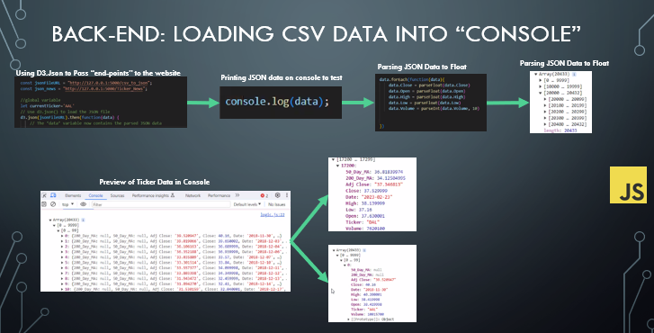
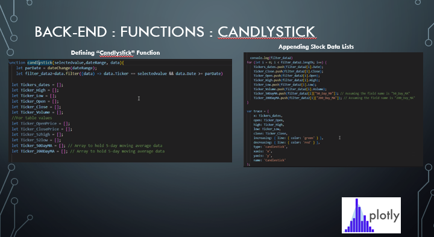
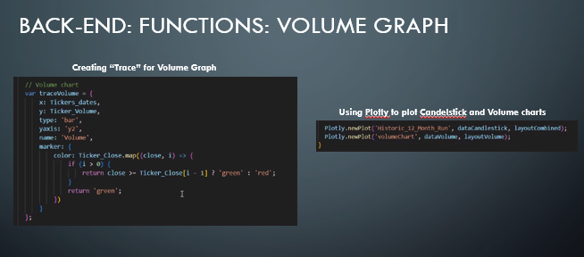
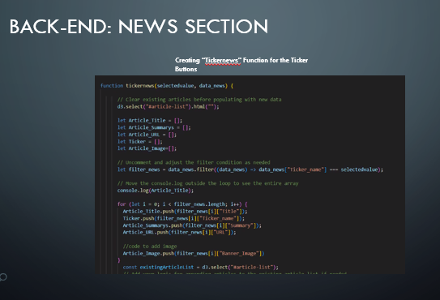
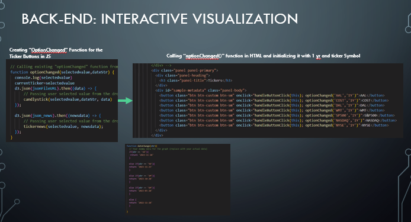
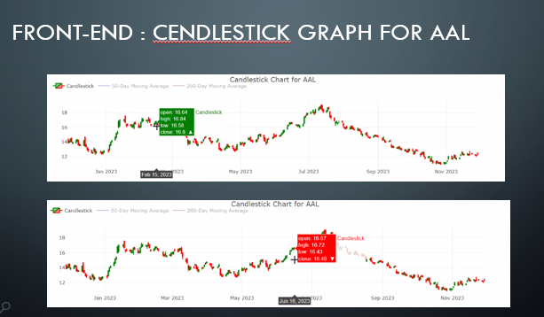
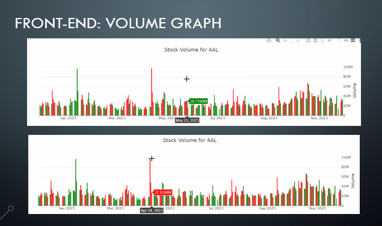
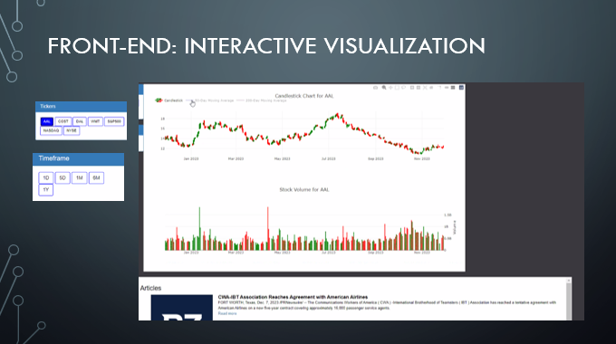

# Markets VS Sentiment Watch

'Market vs Sentiment' is a project that will explore how news articles can affect the value of a particular stock in a positive or negative way. This project analyzes the behavoir of different stocks and indexes from November 2022 - November 2023
for the same tech companies.  

# Data Sources, Languages & Questions to Answer

## Installation
We used the Flask Framework to deploy the Web Application
***
Installing Flask and CORS

``
$ pip install Flask
$ pip install Flask-CORS
``

# Back End:

# Front End:

### Limitation: 
We couldn't find a data source that could present old articles that could relate to stocks prices

